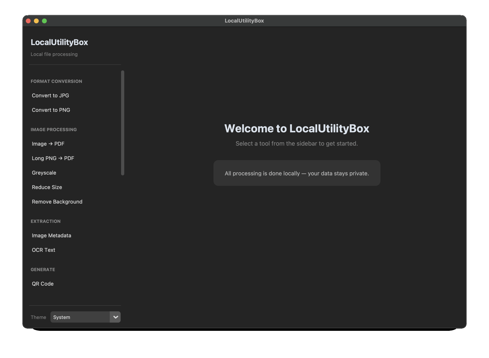
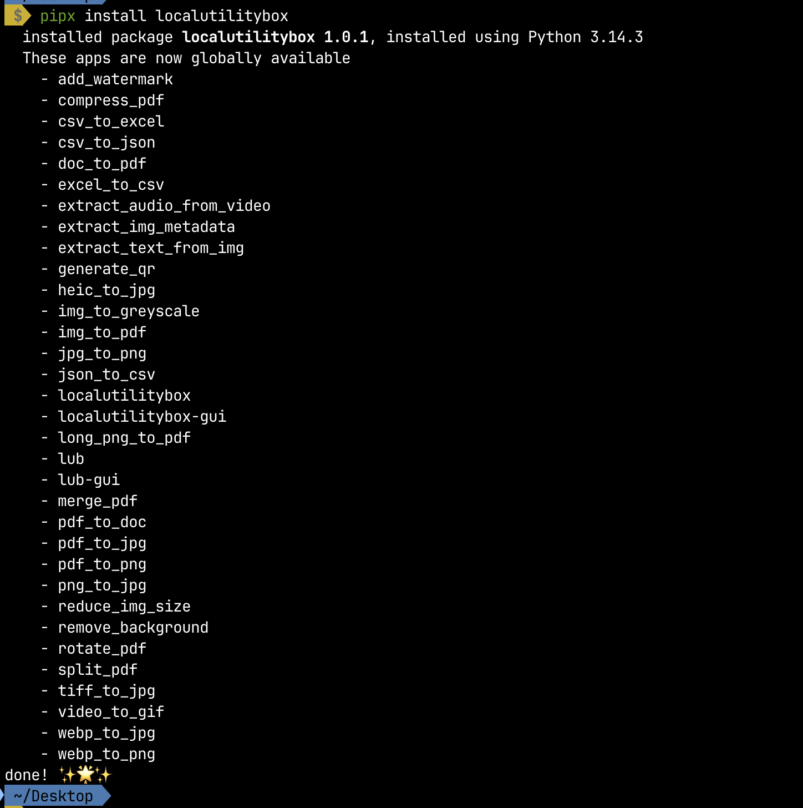

# LocalUtilityBox

[](https://github.com/elokwentnie/local-utility-box/actions/workflows/ci.yml)
[](https://pypi.org/project/LocalUtilityBox/)
[](LICENSE)
[](https://pypi.org/project/LocalUtilityBox/)

**Don't waste your time searching for web solutions -- do it in your terminal.**

LocalUtilityBox is a privacy-first suite of file-processing utilities that runs
entirely on your machine. No uploads, no third-party servers, no subscriptions.
Use it from the command line **or** through the modern desktop GUI.

## Features

- **Image Processing** -- convert between WebP, JPG, PNG, TIFF and HEIC; resize
  and compress; remove backgrounds; convert to greyscale; split long PNGs into
  multi-page PDFs; extract EXIF metadata; OCR text from images; generate QR codes.
- **PDF Management** -- merge, split, compress, rotate/reorder and watermark PDFs;
  convert pages to PNG/JPG.
- **Document Conversion** -- DOC/DOCX to PDF and back.
- **Data Format Conversion** -- CSV, Excel and JSON, any direction.
- **Video / Audio** -- extract audio tracks from video files (MP3, WAV, AAC,
  OGG, FLAC, M4A); convert video clips to animated GIFs.
- **Desktop GUI** -- a modern sidebar-based interface with dark/light theme
  support, drag-and-drop file input, and output directory selection, built with
  customtkinter.
- **CLI** -- every tool is also available as a standalone terminal command. Run
  `localutilitybox` (or `lub`) to list them all.

## Preview

**GUI**



**Terminal**



## Requirements

- Python 3.9+
- [Tesseract OCR](https://github.com/tesseract-ocr/tesseract) (only for `extract_text_from_img`)
- [Poppler](https://poppler.freedesktop.org/) (only for `pdf_to_png` / `pdf_to_jpg`)
- [LibreOffice](https://www.libreoffice.org/) **or** Microsoft Word (only for `doc_to_pdf`)

### System dependencies

Install these before or after the Python package, depending on which tools you use.

**Linux**

| Tool(s) | Ubuntu / Debian | Fedora | Arch |
|---------|-----------------|--------|------|
| All PDF tools | `poppler-utils` | `poppler-utils` | `poppler` |
| `extract_text_from_img` | `tesseract-ocr` | `tesseract` | `tesseract` |
| `doc_to_pdf` | `libreoffice` | `libreoffice` | `libreoffice-fresh` |
| GUI | `python3-tk` | `python3-tkinter` | `tk` |

```bash
# Ubuntu / Debian
sudo apt update
sudo apt install poppler-utils tesseract-ocr libreoffice python3-tk

# Fedora
sudo dnf install poppler-utils tesseract libreoffice python3-tkinter

# Arch Linux
sudo pacman -S poppler tesseract libreoffice-fresh tk
```

**Windows**

| Tool(s) | How to install |
|---------|-----------------|
| All PDF tools | [Poppler for Windows](https://github.com/oschwartz10612/poppler-windows/releases) — download, extract, add `bin` folder to PATH |
| `extract_text_from_img` | [Tesseract installer](https://github.com/UB-Mannheim/tesseract/wiki) — install and add to PATH |
| `doc_to_pdf` | Microsoft Word (if installed) or [LibreOffice](https://www.libreoffice.org/download/download/) |
| GUI | tkinter is included with Python from [python.org](https://www.python.org/downloads/) |

## Installation

### pipx (recommended)

[pipx](https://pipx.pypa.io/) installs Python CLI apps in isolated environments
while making the commands available globally.

```bash
# macOS
brew install pipx

# Windows (PowerShell or Command Prompt)
# Option 1: pip
py -m pip install --user pipx
py -m pipx ensurepath
# Option 2: Scoop (if installed)
scoop install pipx

# Ubuntu / Debian
sudo apt install pipx

# Fedora
sudo dnf install pipx

# Arch Linux
sudo pacman -S python-pipx

# Other Linux: install via pip
python3 -m pip install --user pipx

# Then (all platforms)
pipx ensurepath
# Restart your terminal (or source ~/.bashrc / ~/.zshrc on Linux/macOS)

# From PyPI (after first release)
pipx install LocalUtilityBox

# Or from source
pipx install git+https://github.com/elokwentnie/local-utility-box.git
```

### Optional extras

```bash
# Drag-and-drop in the GUI (Linux, macOS, Windows)
pipx inject localutilitybox tkinterdnd2

# QR code generation
pipx inject localutilitybox 'qrcode[pil]'

# AI background removal (large download)
pipx inject localutilitybox 'rembg[cpu]'
```

### From source

```bash
git clone https://github.com/elokwentnie/local-utility-box.git
cd local-utility-box

# Create and activate virtual environment
python -m venv .venv
# Windows:  .venv\Scripts\activate
# Linux/macOS:  source .venv/bin/activate

pip install .

# Optional extras:
pip install tkinterdnd2     # drag-and-drop in the GUI
pip install 'qrcode[pil]'   # QR code generation
pip install 'rembg[cpu]'   # AI background removal
```

### Verify

```bash
lub                     # list all available tools
heic_to_jpg --help      # test a CLI command
lub-gui                 # launch the GUI
```

### GUI prerequisites

The GUI depends on **tkinter** (required by customtkinter). Install it if your
Python distribution does not bundle it:

```bash
# macOS (Homebrew)
brew install python-tk@3.13

# Linux: see "System dependencies" table above (python3-tk / python3-tkinter / tk)

# Windows: tkinter is included with Python from python.org
```

On Linux, the GUI runs on X11 or Wayland with a desktop environment. On Windows,
use the standard desktop. For **drag-and-drop** file input on any platform,
install the optional `tkinterdnd2` extra:

```bash
pipx inject localutilitybox tkinterdnd2
```

## Usage

### Desktop GUI

```bash
localutilitybox-gui   # or: lub-gui
```

The GUI provides a sidebar with every tool organised by category. Select a tool,
fill in the inputs, and click the action button. A status bar shows real-time
progress and the output file location. Switch between System, Light and Dark
themes from the bottom of the sidebar. Drag-and-drop file input is supported
when `tkinterdnd2` is installed (see GUI prerequisites above).

### Command Line


Every tool ships as its own command. Run `localutilitybox` (or `lub`) to see the
full list. A few examples:

```bash
# Image conversion
webp_to_jpg image.webp -o image.jpg -b white
heic_to_jpg -f photo1.heic photo2.heic
heic_to_jpg -d /path/to/heic/files

# PDF management
merge_pdf -f a.pdf b.pdf c.pdf -o merged.pdf
split_pdf input.pdf -p 3
compress_pdf input.pdf
rotate_pdf input.pdf --rotation 90
add_watermark input.pdf -w watermark.pdf -p 0 1 2

# QR code (requires qrcode[pil])
generate_qr "https://example.com" -o qr.png

# Document conversion
doc_to_pdf report.docx -o report.pdf
pdf_to_doc report.pdf -o report.docx

# Data formats
csv_to_excel data.csv -o data.xlsx
csv_to_json data.csv -o data.json

# Long PNG to paginated PDF
long_png_to_pdf screenshot.png -p a4 --overlap 20

# Video / audio
extract_audio_from_video video.mp4 -f mp3 -o audio.mp3
video_to_gif clip.mp4 --fps 15 --width 480
```

Run any command with `--help` for full usage details.

## Docker

```bash
docker build -t localutilitybox .
# Linux/macOS:
docker run -it -v "$(pwd)/files:/data" localutilitybox
# Windows (PowerShell):
docker run -it -v "${PWD}/files:/data" localutilitybox
```

## Contributing

Contributions are welcome! See [CONTRIBUTING.md](CONTRIBUTING.md) for guidelines.

## License

[MIT](LICENSE) -- see the LICENSE file for details.
